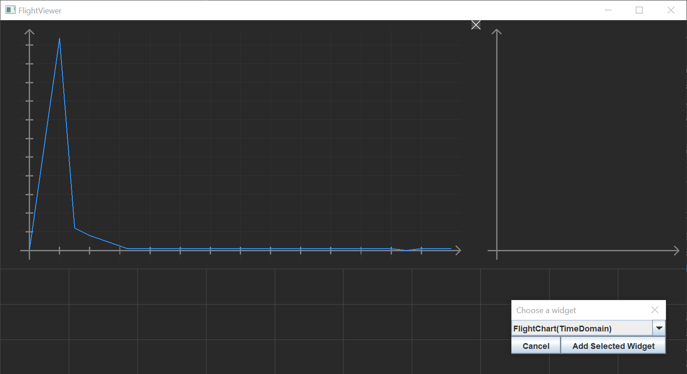

# JVisualizer
This is a GUI framework for rendering user-placeable (by clicking and dragging) widgets (currently only on a grid) using OpenGL.

The main use case for this framework is to render charts of model-rocket flight data.

Word of caution: This was developed in 2017 mainly to learn OpenGL. It is implemented in an "immediate mode"-ish fashion but the separation between rendering code and event-handling/widget-management is still a little to low for my taste (and proper maintainability).